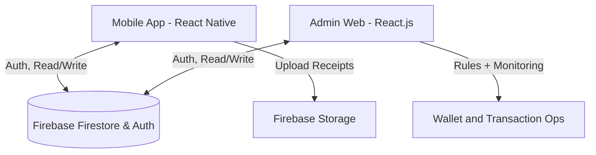

<div align="center">
  
  
  
  

  <h1>🚀 ExpensAI Full-Stack System</h1>
  <p>A next-generation corporate expense tracking and dynamic wallet management platform.</p>
</div>

---

## 📖 About The Project

ExpensAI is a comprehensive, highly decoupled full-stack platform designed to bridge the gap between employee out-of-pocket expenses and corporate budget management. By providing two completely integrated interfaces—a native mobile application for employees and a powerful web dashboard for managers—ExpensAI streamlines the lifecycle of corporate spending. 

Powered by a centralized **Firebase** architecture, actions like expense submissions, receipt uploads, wallet deductions, and managerial approvals happen in real-time.

## ✨ Key Features

### 📱 For Employees (`/mobile-app`)
Built with **React Native (Expo)**, the mobile application focuses on reducing friction for end-users on the go.
*   **Authentication:** Email/Password based login. (Google OAuth is disabled due to Expo limitations).
*   **Smart Receipt Upload & OCR:** Upload receipts to automatically parse details and pre-fill expense reports.
*   **Location Tagging:** Expenses can be tagged with precise GPS coordinates for auditing.
*   **Real-Time Wallet:** See your allocated corporate budget deduct in real-time as you submit UPI/Card transactions.
*   **Native Dark/Light Mode:** First-class responsive theming tied to the user's OS preference.

### 💻 For Managers (`/admin-dashboard`)
Built with **React.js (Vite)**, the admin dashboard offers complete visibility into organizational spending.
*   **Live Expense Feed:** Monitor expenses submitted by employees worldwide in real-time via Firestore WebSockets. 
*   **One-Click Approvals:** Instantly approve, reject, or flag employee submissions. Rejected expenses atomically refund the employee's dynamic wallet.
*   **Dynamic Access & Budget Controls:** Individually allocate budgets and toggle specific feature access (e.g., adding out-of-pocket bills vs. corporate wallet deduction) remotely per employee.
*   **Analytics & Filtering:** Quickly search and drill down into spending categories.

---

## 🏗️ Architecture & Tech Stack

The platform is powered by a serverless Event-Driven architecture ensuring scalability without traditional backend boilerplate.



*   **Frontend:** React Native (Expo SDK 54+), React 19, Vite, React Navigation
*   **Backend as a Service (BaaS):** Firebase (Firestore, Authentication, Storage)
*   **State Management:** React Context API + Custom Hooks
*   **Integrated third-party APIs:**
    *   **Mistral AI API:** Extracts details (like total amount and category) automatically from uploaded receipts.
    *   **Google Maps & Geocoding API:** Tracks and renders accurate GPS coordinates for expense locations on both the mobile app and admin dashboard.
    *   **Google Cloud Vision API:** Image-to-text fallback integration for robust receipt scanning.
    *   **Authentication:** Configured via Firebase Auth.

> 📚 Check out the detailed reasoning behind our technology choices in the [Technical Architecture Guide](./TECH_STACK.md).

---

## 📂 Project Structure

This robust monorepo-style setup includes distinct directories for the frontends and shared logic:

```text
📦 ExpensAI
 ┣ 📂 mobile-app/          # The React Native + Expo Employee App
 ┣ 📂 admin-dashboard/     # The React + Vite Manager Dashboard
 ┣ 📂 firebase/            # Shared security rules and configurations
 ┣ 📜 README.md            # The document you are reading
 ┣ 📜 SETUP_GUIDE.md       # Getting started and deployment guide 
 ┗ 📜 TECH_STACK.md        # Technical architecture documentation
```

---

## 🚀 Setup Guide to Run the Programs

> [!WARNING]
> **Disclaimer:** Expo does not support the Google Auth flow natively inside the development client, so avoid using it. Use standard Email & Password auth for development.

Deploying and running ExpensAI requires setting up a Firebase project and configuring the `.env` variables for both client applications. 

### 1. Clone the Repository
```bash
git clone https://github.com/KrishBansal24/ExpensAI.git
cd ExpensAI
```

### 2. Configure Firebase Data
Create a `.env` file in the `/admin-dashboard` and populate it:
```env
VITE_FIREBASE_API_KEY=your_api_key
VITE_FIREBASE_AUTH_DOMAIN=your_project.firebaseapp.com
VITE_FIREBASE_PROJECT_ID=your_project
VITE_FIREBASE_STORAGE_BUCKET=your_project.appspot.com
VITE_FIREBASE_MESSAGING_SENDER_ID=your_sender_id
VITE_FIREBASE_APP_ID=your_app_id
```

Do the same for `/mobile-app` utilizing `EXPO_PUBLIC_FIREBASE_` prefixed equivalents.

### 3. Run the Admin Dashboard (Web)
```bash
cd admin-dashboard
npm install
npm run dev
```
The dashboard will be available at `http://localhost:5173` or paste this in browser 'https://project-rmvv2.vercel.app'.

### 4. Run the Employee App (Mobile)
Open a new terminal session and start the Expo dev server:
```bash
cd mobile-app
npm install
npx expo start
```
Scan the resulting QR code using the **Expo Go** application on your iOS or Android device.


> ⚙️ **Looking to deploy to Production?** For detailed instructions on Vercel deployment and EAS builds, see the [Advanced Setup & Deployment Guide](./SETUP_GUIDE.md)!

---

<div align="center">
  <i>Built with ❤️ by the ExpensAI Team</i>
</div>
