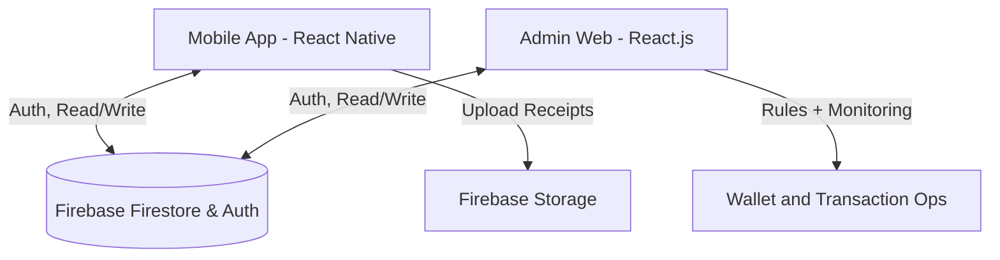

# Technical Architecture & Stack

## System Overview

ExpensAI is built as a highly decoupled full-stack system using Firebase as a central Backend-as-a-Service (BaaS).



## Tech Stack Choices & Rationale

### 1. Frontend Frameworks
- **React Native (Expo)**: Chosen for the mobile app to ensure a purely native feel on both iOS and Android while utilizing a single JavaScript codebase. Expo accelerates development by removing the need for Android Studio/Xcode configuration.
- **React.js (Vite)**: Chosen for the Admin Dashboard. Vite provides instantaneous hot-module replacement (HMR) during development. React allows fast component composition for live tables, filters, and analytics.

### 2. Backend (Firebase)
Firebase was selected as the backend over a traditional Node.js/Express + PostgreSQL stack for several critical reasons:
- **Real-time Sync**: Firestore provides out-of-the-box WebSocket connections. When a manager approves an expense on the web dashboard, the mobile app UI updates instantly without requiring a refresh or long-polling.
- **Integrated Auth**: Firebase Authentication handles complex OAuth flows (Google Sign-In) natively on both mobile and web seamlessly.
- **Developer Velocity**: Removes the need to write CRUD boilerplate APIs, allowing focus on UI/UX for an ideathon.

### 3. State Management
- **Context API + Custom Hooks**: Used for global state (User session, Theme preference). 
- *Why not Redux?* Firestore handles real-time data caching client-side automatically. Using Redux would duplicate data unnecessarily. Context is sufficient for UI state.

### 4. Styling
- **Web**: Vanilla CSS with CSS Custom Properties (`var(--color)`) for highly performant and easy theme switching (Dark Mode).
- **Mobile**: `StyleSheet` API with a centralized Theme constant file for dark/light mode integration.

## Data Flow & Structure

### Firestore Schema

**`users` collection**
```json
{
  "id": "abc123xyz",
  "name": "Jyoti Sharma",
  "email": "jyoti@acmecorp.com",
  "role": "employee",
  "department": "Engineering",
  "walletAssigned": 50000,
  "walletBalance": 31250,
  "walletSpent": 18750,
  "period": "March 2026",
  "active": true
}
```

**`transactions` collection**
```json
{
  "id": "txn_789xyz",
  "userId": "abc123xyz",
  "userName": "Jyoti Sharma",
  "amount": 850,
  "category": "food",
  "paymentMode": "UPI",
  "status": "pending",
  "timestamp": "2026-03-22T09:30:00.000Z",
  "location": { "lat": 28.4945, "lng": 77.0888 },
  "reviewedBy": null,
  "reviewedAt": null
}
```

### Real-Time Wallet Flow
- Admin allocates budget in dashboard -> updates `users.walletAssigned` and `users.walletBalance`.
- Employee creates UPI transaction in mobile app -> writes to `transactions` and deducts from wallet in one transaction.
- Admin approves/rejects from dashboard -> updates `transactions.status` instantly.
- On reject, wallet refund is applied to `users.walletBalance` and `users.walletSpent` atomically.

## Scalability
- **Database**: Firestore scales horizontally automatically. It relies on indexes for queries, meaning querying 10 expenses takes the same time as querying 10 million expenses.
- **Hosting**: Vercel provides global CDN distribution for the admin dashboard.
- **Storage**: Firebase Storage uses Google Cloud Storage infrastructure.
